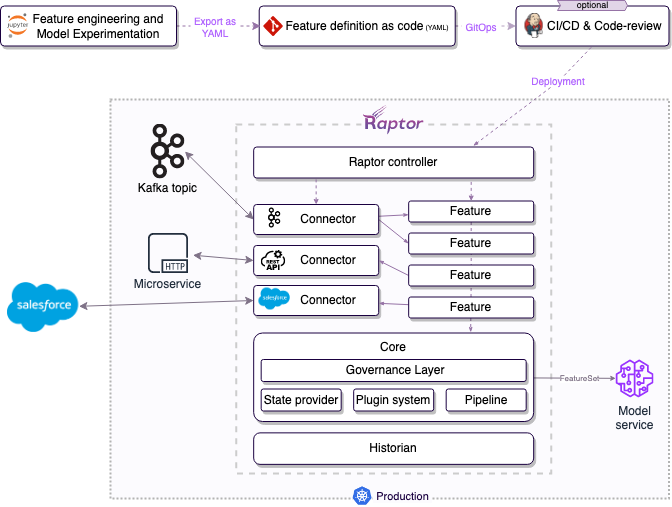

# How does Natun work?

Natun is extending Kubernetes to serve features in a production-grade manner. It's implementing the "Kubernetes Way," which advocates for writing the desired state and allows you to focus on writing the business logic.
Natun takes care of the engineering concerns of implementing the "desired state" by managing and controlling Kubernetes-native resources such as deployments to connect your production data-sources and to run your business logic at scale.

To achieve that, Natun must understand the logic of the Feature and create the engineering setup required for the production version and introduce a new way of describing features - Feature Definitions.

:::info
Feature Definitions are usually stored in Git, like any other Kubernetes' manifest you have in your organization.
This approach carries benefits such as review and comparison for every change, an ability to see previous versions, etc.
:::

Feature Definitions only become Features after Natun Operator spins off the necessary compute, connections, and storage resources. We recommend using your CI/CD to deploy the Feature Definitions to the Kubernetes cluster, as you do with any other Kubernetes resource. Applying your DevOps policies like code-review or "staging first" can be very useful and can finally make DS resources an integral part of your RND.

After the Feature Definitions have been deployed to your cluster, Natun Operator automatically discovers them and uses the relevant [Builder](./feature-builders) to configure the resources needed for the Feature. Such resources include data-connectors to external sources, storage resources, and compute resources.

Finally, after the Features have been deployed, you can server these features to the model or utilize the [FeatureSet](./feature-sets) to prepare a ready-to-use data-set.