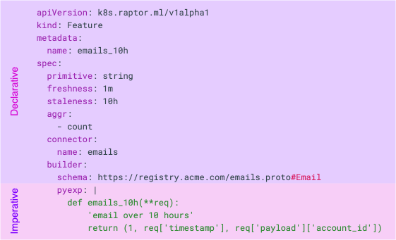

# Feature Definitions

To build production-ready features, Raptor must understand the logic of the Feature and create the engineering setup
required for the production version and introduce a new way of describing features - Feature Definitions.

Feature Definitions are new Kubernetes resources that bundle the Feature's logic and the engineering aspects;
they're usually written as YAML manifests and composed of two parts:

1. **Declarative definition-**  
   Instruct Raptor on implementing the advanced mechanisms in production while implementing them differently for
   training purposes.
2. **Imperative definition-**  
   The Python code allows you the freedom and creativity to do fancy stuff.

Raptor uses these definitions to create your features in research and production environments, provision the necessary
data connections, compute and storage resources, and offer collaboration, management and governance layers around
features.

Features are usually written by the data-scientists while developing the model using the LabSDK,
then they can be exported to the Feature Definitions as [YAML](https://yaml.org/) files - and are both human and
machine-readable.