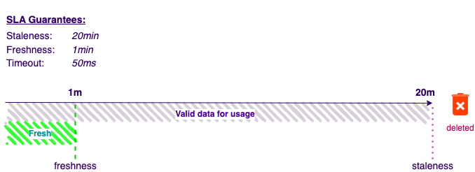

# Features SLA

Raptor helps you deploy and manage Operative Features in production, and operative production flows expect strict **guarantees** of time to response (latency), freshness of data, consistency, availability, and resilience to dynamic conditions such as a spike in usage or a return from downtime ("thundering herd" phenomena).

Raptor allows you to express your desired guarantees in a friendly form, and Raptor will configure the connectors, compute and storage resources to ensure that guarantees are kept.

When creating the Feature Definition, you specify three important values: **Freshness, Staleness, and Deadline.**

When a feature value is requested, Raptor checks whether a value stored in its Feature Store is fresh. A feature value is considered fresh if the time it was calculated was at most "**Freshness**" ago. For example, if the Freshness definition for a feature is 1s, then any value that is less than 1 second old in the store can be returned immediately without recalculation. Any value older than 1 second ago is considered non-fresh.

A non-fresh feature value might still be served if it's not **Stale**. **Staleness** defines when a feature value cannot be served under any circumstances, and must be recalculated.

Freshness would usually be shorter than Staleness, and if a feature is not fresh anymore but not yet stale, Raptor will try to calculate a new value within the **Deadline** . If calculation finishes within the deadline (remember, it might include accessing external high-latency services), the newly calculated value is returned. Otherwise, the cached value (which is not fresh but is also not stale yet) is returned.

The **Deadline** mechanism ensures responses will always be sent within a guaranteed timeframe. For example, if you're implementing personalization in the user flow then keeping latency low or unnoticeable to the user is key.

Here's a summary of the logic of freshness, staleness and deadline:

1. Fresh feature values are returned immediately
2. Non-fresh but non-stale values may be returned up to the deadline if recalculation took too long, otherwise the recalculated value is available before the deadline.
3. Stale values are never returned. Raptor will try to recalculate the feature value for up to the Deadline time, and if unable to do so - return an error.  

