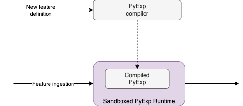

import DocCard from '@site/src/components/DocCard'

# Python Expression Language (PyExp)

Some feature builders allow us to express our feature's "business logic" via Natun's Python Expression (PyExp) Language.

:::success
Using PyExp, we can benefit from a deterministic, secure, and production-grade sandboxing of the code for your business logic.
:::

## Syntax

PyExp's syntax is inspired by Python3. This is valid syntax in PyExp:

```python
def fizz_buzz(n):
  """Print Fizz Buzz numbers from 1 to n."""
  for i in range(1, n + 1):
    s = ""
    if i % 3 == 0:
      s += "Fizz"
    if i % 5 == 0:
      s += "Buzz"
    print(s if s else i)

fizz_buzz(20)
```

PyExps semantics can differ from Python, but behavioral differences are rare, except for cases where PyExp raises an error. The following Python types are supported:

* [`None`](pyexp-language-definition/data-types.md#none "mention")
* [`bool`](pyexp-language-definition/data-types.md#booleans "mention")
* [`dict`](pyexp-language-definition/data-types.md#dictionaries "mention")
* [`def`](pyexp-language-definition/data-types.md#functions "mention")
* [`int`](pyexp-language-definition/data-types.md#integers "mention")
* [`list`](pyexp-language-definition/data-types.md#lists "mention")
* [`string`](pyexp-language-definition/data-types.md#strings "mention")

## Building features with PyExp

Implementing features with PyExp is easy. The only thing you need to implement is the function `handler`:

```python
def handler():
  """Implement city feature"""
  return "Tel-Aviv"
```

For more information read:

<DocCard docId="reference/pyexp/handler-function" />


In addition, you can use the [natun built-ins](pyexp/natun-built-ins/) in order to depend on other features (and leverage that for "joins" like features), or do complex transformations.


for more information read:

<DocCard docId="reference/pyexp/natun-built-ins/readme" />

## PyExp in production

After a feature is being deployed to the cluster, Natun will compile your PyExp code into bytecode. This process allows us to run your PyExp in a dedicated runtime sandbox and provide us with a production-ready code that is safe, reproducible, and deterministic.



It's important to emphasize that the PyExp code is restricted of I/O operations in order to protect the code for production running. Only specific operations(which are implemented by the runtime) are allowed to do I/O.


:::info
PyExp is based on a python dialect called Starlark. For a complete list of functions and types, check the [Pyexp language definition](pyexp/pyexp-language-definition/).
:::
