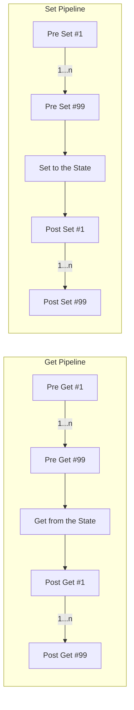

# Feature Definitions

Feature Definitions are an abstraction that contains metadata about the feature that should lead to create a Feature Value.

Feature definitions contains:

- FQN (Fully Qualified Name): a unique name which is the composition of `{name}.{namespace}[aggr_fn?]`
- Primitive Type:
- `Int`
- `String`
- `Float`
- `Timestamp`
- `[]Int`
- `[]String`
- `[]Float`
- `[]Timestamp`
- Freshness duration - The duration which within the feature value is considered as fresh, and shouldn't be recalculated
- Staleness duration - The duration which after it the feature is considered as stale and *is invalid* to be used.
  The state should evict/expire that value after that, and only story it for historical purposes.
- Timeout duration - The maximum time the server should respond with a feature value. In this time it tries to get
  the most fresh value it can provide (considering the above constrains)

## Feature Value

The Feature Value is the computed value of a feature's ingestion.

Properties:

- `fqn`
- `entity_id`
- `value`
- `timestamp`

# Core

The Core is the main component of Raptor. It acts as a "compiler" for the Raptor Feature Definitions, and responsible
for the "production" implementation for these definitions.

The Core is responsible to:

1. Read the Feature Definitions
2. Create an appropriate "builder" for each Feature Definition using the internal [read/write pipelines][#Pipleines],
   and [runners][#Data-ingestion]
3. Maintain the orchestration and monitoring of the system

It has a few key components:
1. [Engine][#Cores-engine] - responsible for the feature pipeline implementation
2. [Operator][#Cores-operator] - responsible for the orchestration of the system(including spawning different services)
3. State- responsible for the state of the system, including the state of the features and the
   state of the system itself
4. Accesssor - responsible for the access to the state of the system via the API
5. Plugin system - responsible for the loading of the plugins

## Kubernetes Controller

The Kubernetes controller enables the user to use Raptor using the Kubernetes world. It is implemented as a part of the
Core.

- The controller supports validation on time of manifest create
- It "read and implement" the CRDs
    - Feature - defines a feature metadata & business logic
    - DataConnector - defines a connector configuration (i.e. how to connect to Kafka, what's the creds, what's the
      topic,
      schema, allocated resources, etc.)
    - FeatureSet - defines a set of features.
- Update operations for Features are blocked by default and will be enabled _only by enabling a special flag_.

## Core's engine

The Core's engine is responsible for accessing and processing the feature values, as well as storing them in the State,
and executing pipelines.

## Core's operator
The Core's operator is responsible for the orchestration of the system. It is responsible for the following:
1. Spawning the different services such as Runners
2. Modifying the CR's status
3. Implementing CR's webhooks

## Low-level API

The low-level API (aka Engine API) support low-level operations over feature values:
```go
// Engine is the main engine of the Core
// It is responsible for the low-level operation for the features against the feature store
type Engine interface {
	// Metadata returns the metadata of the feature
	Metadata(ctx context.Context, FQN string) (Metadata, error)
    // Get returns the SimpleValue of the feature.
    // If the feature is not available, it returns nil.
    // If the feature is windowed, the returned SimpleValue is a map from window function to SimpleValue.
	Get(ctx context.Context, FQN string, entityID string) (Value, Metadata, error)
    // Set sets the SimpleValue of the feature.
    // If the feature's primitive is a List, it replaces the entire list.
    // If the feature is windowed, it is aliased to WindowAdd instead of Set.
	Set(ctx context.Context, FQN string, entityID string, val any, ts time.Time) error
    // Append appends the SimpleValue to the feature.
    // If the feature's primitive is NOT a List it will throw an error.
	Append(ctx context.Context, FQN string, entityID string, val any, ts time.Time) error
    // Incr increments the SimpleValue of the feature.
    // If the feature's primitive is NOT a Scalar it will throw an error.
    // It returns the updated value in the state, and an error if occurred.
	Incr(ctx context.Context, FQN string, entityID string, by any, ts time.Time) error
    // Update is the common function to update a feature SimpleValue.
    // Under the hood, it utilizes lower-level functions depending on the type of the feature.
    //  - Set for Scalars
    //	- Append for Lists
    //  - WindowAdd for Windows
	Update(ctx context.Context, FQN string, entityID string, val any, ts time.Time) error
}
```

It is exposed via the Accessor as gRPC and Rest.

## Online-aggregations

The engine support online aggregation (using the bucket algorithm)

- SUM
- MAX
- MIN
- AVG
- COUNT

# Pipelines

Getting and Setting values to the State is done using the "pipeline". The pipeline is composed by a chain of middleware
functions that wraps the access to/from the State by the priority(the lowest priority, the earlier it's executed) that
each middleware is defined with:



The middlewares allow chaining a set of functions when getting or setting a value, in order to mutate the value (or to
prevent the operation). This is useful for implementing a variety of features, including:

- Validations - validations are PreSet middlewares
- DataConnectors that retrieve the data on the time-of-request (i.e. REST API)
- Transformations
- Encoders - i.e. attach "hashing" for the value at PostGet

# Builders

Builders are the composition of all the elements required to create a feature value:

1. Builder Kind - specifies the type of the builder composer. This is the unit that composing the pipeline and the
   implementation details of the builder (and sometimes responsible for the connector implementation).
2. Aggregations definition (if any)
3. PyExp code

To build features, the builder required to pull configurations from two places:

- DataConnector CRD - defining the connection configuration
- Feature CRD - defining the business logic of a feature creation
  

:::tip
Builders are an amorphic concept that unite together a set of instructions how to build the feature value.
There is no one unit that implements it.
:::

# Data ingestion

Data ingestion can be implemented externally or internally

- Externally - as a standalone service (aka "Runner" deployment)
  This can be implemented by writing a custom microservice (i.e. for webhook or streaming connectors)

- Internally - in-process of the "Core", utilizing the GET/SET pipeline.
  This can be implemented by writing a "plugin" to that adds a middleware for this feature

Writing data as "feature value" is done using the "low-level API" (whether it's internally via the library or externally
by the runtime sidecar)

# Historian

The historian is responsible to keep records of the (current) State (of the world), to a storage.
It does that by scheduling a periodic snapshotting of the State to the storage.

## Snapshotting

Snapshotting is the process that is responsible for copying data from the real-time/online state to the historical
storage.

This process is composed of 3 different sub-processes:

1. **Regular features snapshotting**
2. **Scheduled Windowed-features snapshotting**
3. **Storing process** - Synchronizes write calls

### Regular features snapshotting

We are keeping every **change** to the feature. To do that we just need to hook in just after the write in the pipeline.

Every feature's writing request in the pipeline triggers writing to a distributed queue:

1. Pipeline: write
2. →Pipeline: Go routing to `Historian.AddWriteNotification(fqn, entityId,value)`
3. →Historian library: write a *notification message* to a Redis stream

### Windowed features snapshotting

Due to the different behavior and volatility of windowed features, a different implementation is required:

- *Windowed features* are prune to MANY writes (due to the fact they are used to storing aggregations)
- Copying every change is expensive, inefficient and duplicating the raw data under the hood.
- We are triggering snapshotting of windowed features by:
    - A periodic snapshotting (every 5 minutes)
    - Trigger an "update notification" when a windowed feature is written to

To support the above, we are required to keep buckets in the state a little longer to make sure we're collecting them.

## Synchronization process

The Synchronization process is running only on a leader instance.
It utilizes an internal job queue combines duplicated *writes* and *collection* notifications, and handles them.

### Collect Notifications

- collect the values
- Add a *writing job* of the results

### Write jobs:

- The Writing process is running only on a leader instance.
- Writing the historical records to Historical Provider (i.e. Parquet S3, Snowflake, BigQuery, etc.)

# Glossary

- CRD - Custom Resource Definition
- Feature - A data input for the model which describes a trait of our data
- Feature Definition/Manifest - A feature's business logic declarative code. This is used by data scientists(via the
  LabSDK) to describe how the Core should generate feature values from *raw data* and how the platform should store it.
- FeatureSet - A set of features that are used to serve a specific model.
- DataConnector - A *conceptual* unit that retrieves the data from the production system. Sometimes it's an actual unit(
  i.e. Kafka Runner), and sometimes it's just configuring a program.
- DataConnector Manifest - The configuration of the DataConnector
- Core - The main platform's program. This is the unit that is responsible to glue it all together
- Read/Write pipeline - The pipeline of fetching/setting data from/to the storage. At its middle, we have the actual
  operation of the storage.
- Middlewares - The steps that wrap the read/write of the store
- Runner - A unit that is running outside the Core and responsible
- Historical Provider - the historical storage implementation. We're taking snapshots of the current state to it.
- State - The state is the unit the stores the feature values to be served to models. It describes the current state of
  the world.