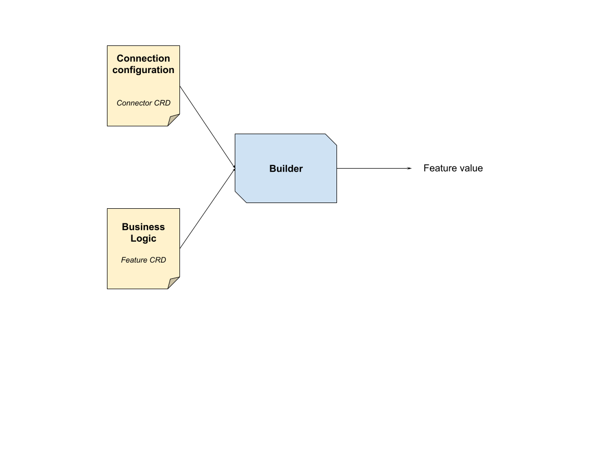

# Core

## Kubernetes Operator

The Kubernetes operator enables the user to use Natun using the k8s world

-   The operator will support validation on time of manifest create
-   CRDs
    -   Feature - defines a feature metadata & business logic
    -   DataConnector - defines a connector configuration (i.e. how to connect to Kafka, what's the creds, what's the topic, schema, allocated resources, etc.)
    -   FeatureSet - defines a set of features.
-   Update operations for Features are blocked by default and will be enabled _only by enabling a special flag_.

## Core's engine

The Core's engine is responsible for accessing and processing the feature values, as well as storing them in the State and saving them to the Historical Storage.

### Features
Features are an abstraction that contains metadata about the feature that should lead to create a Feature Value.

Feature definitions contains:
- FQN (Fully Qualified Name): a unique name which is the composition of `{name}.{namespace}`
- Primitive Type:
    -   `Int`
    -   `String`
    -   `Float`
    -   `Timestamp`
    -   `[]Int`
    -   `[]String`
    -   `[]Float`
    -   `[]Timestamp`
- Freshness duration - The duration which within the feature value is considered as fresh, and shouldn't be recalculated
- Staleness duration - The duration which after it the feature is considered as stale and *is invalid* to be used.
                        The state should evict/expire that value after that, and only story it for historical purposes.
- Timeout duration - The maximum time the server should respond with a feature value. In this time it tries to get
                        the most fresh value it can provide (considering the above constrains)

### Feature Value
The Feature Value is the computed value of a feature's business logic that is stored in the historical/online storage layers(aka feature store / fs)
Properties:
-   `fqn`
-   `entity_id`
-   `value`
-   `timestamp`

###  Low-level API
The low-level API (aka Engine API) should support low-level operation over feature values:

-   Mutate features:
    -   `SET(fqn, entity_id, value, timestamp?)`
    -   `GET(fqn, entity_id, timestamp?)`
    -   `UPDATE(fqn, entity_id, value, timestamp?)` - set value or append to a list
    -   `INCR(fqn, entity_id, by, timestamp?)` - increment a value in a scalar (not for online aggr.)
    -   `APPEND(fqn, entity_id, value, timestamp?)` - append a value to a list
-   LIST of features
-   GET feature-set (implemented as a feature builder)
-   SET in bulk

### Online-aggregations
The engine should support online aggregation (using the bucket algorithm)
-   SUM
-   MAX
-   MIN
-   AVG
-   COUNT

### Auto-backfill
[TBD]

### Pipelines
Getting and Setting values to the State is done using the "Pipeline". The Pipeline is composed with a chain of middlewares that wraps the access to/from the State.

The middlewares allow chaining a set of functions when getting or setting a value, in order to mutate the value (or to prevent the operation).
This is useful for implementing a variety of features, including:
-   Validations - validations are PreSet middlewares
-   Builders
    -   REST builder - this can be implemented either with PreGet or PostGet
-   Encoders - i.e attache "hashing" for the value at PostGet

### Snapshotting

Snapshotting is the process that is responsible for copying data from the real-time/online state to the historical storage.

This process is composed of 3 different sub-processes:

1.  **Regular features snapshotting**
2.  **Windowed-features snapshotting**
3.  **Storing process / Historian**
    1.  Synchronizing writes
    2.  Scheduler

#### Regular features snapshotting - PrimitiveSnapshotter

We are keeping every **change** to the feature. To do that we just need to hook in just after the write in the pipeline.

Every feature's writing request in the pipeline triggers writing to a distributed queue:

1.  Pipeline: write
2.  →Pipeline: Go routing to Historian.syncMessage{fqn, entityId} **(without value!)**
3.  →Historian: write a *notification message* to a Redis stream

#### Windowed features / WindowSnapshotter

Due to the different behavior and volatility of windowed features, a different implementation is required:

-   *Windowed features* are prune to MANY writes (due to the fact they are used to storing aggregations)
-   Copying every change is expensive, inefficient and duplicating the raw data under the hood.

#### Historian

The historian is responsible for syncing and scheduling history records to the historical storage (offline store).

The historian is running only on a leader instance.

// TODO should we implement it in spark?

1.  It has an internal job queue that combines duplicated *writes*: [workqueue](https://pkg.go.dev/k8s.io/client-go/util/workqueue)
2.  It's responsible for snapshotting the *dead windows* buckets every over a specified D duration.
    3.  → send a *write job* queue
4.  It's responsible for synchronizing jobs from the streams:
    5.  Expose a function that writes a *notification message* to the streams
7.  Every X seconds it's executing the jobs
    -  Collect Jobs
        1. combine them into a single Redis read transaction
        2. read the values
        3. Add a *writing job* of the results
    -  Write jobs:
        1.  Write the historical records to Parquet files

## Builders
The builder is the concept responsible to create a feature-value for a specific use-case (i.e. REST, expression, Kafka, salesforce, etc)

-   The builder configuration is defined in two places:
-   DataConnector CRD - defining the connection configuration
-   Feature CRD - defining the business logic of a feature creation
-   Part of this resource specifies how the builder should behave

-   Builder can be implemented externally or internally
-   Externally - as a standalone service (aka "runner" deployment)
This can be implemented by writing a custom micro-service
-   Configuring the runner
-   Configuration is being set in deployment time
-   The runner cal pull the configuration from the CORE using polling (i.e. in a case of adding a feature to the same connector)
-   Internally - in-process of the "CORE"

This can be implemented by writing a "plugin" to that adds a middleware for this feature

-   Writing data from the "builders" to the "feature value" is done using the "low-level API" (whether it's internally or externally)

-   Implementing a new builder requires implementing an interface (and optionally a standalone runner as a docker):
-   BuilderName
-   OnNewFeature - run at reconciling time
-   PreGet - returns a list of pre-get middlewares
-   PostGet
-   PreSet
-   PostSet
-   ExternalConfig(\[]conn,\[]features) -\> any

# Glossary

-   CRD - Custom Resource Definition
-   Feature - A data input for the model which describes a trait of our data
-   Feature Manifest - A feature's business logic declarative file. This is used by data scientists to describe how the platform should generate feature values from *raw data* and how the platform should store it.
-   FeatureSet - A set of features that are used to serve a specific model.
-   Builder - A *conceptual* building block that covers a business-logic use-case(i.e. Streaming, gRPC, REST, Salesforce) and helps users to build transformation without much hassle.
            A builder can be implemented either with a Runner or with a Middleware (or a combination of them).
-   DataConnector - A *conceptual* unit that retrieves the data from the production system. Sometimes it's an actual unit(i.e. Kafka Runner), and sometimes it's just configuring a program.
-   DataConnector Manifest - The configuration of the DataConnector
-   CORE - The main platform's program. This is the unit that is responsible to glue it all together
-   Read/Write pipeline - The pipeline of fetching/setting data from/to the storage. At its middle, we have the actual operation of the storage.
-   Middlewares - The steps that wrap the read/write of the store
-   Runner - A unit that is running outside of the CORE and responsible
-   Store Provider / Provider - the storage implementation. In theory, it is possible to replace it.
-   State - The online storage
-   Historical Storage